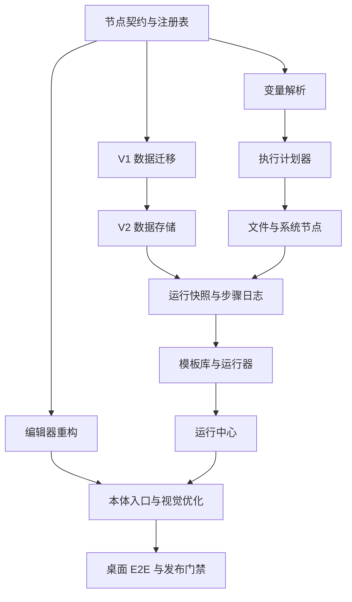

# Workflow Redesign Implementation Plan

> **For agentic workers:** REQUIRED SUB-SKILL: Use superpowers:subagent-driven-development (recommended) or superpowers:executing-plans to implement this plan task-by-task. Steps use checkbox (`- [x]`) syntax for tracking.

**Goal:** 将 Workflow 扩展升级为以模板快速运行、文件系统自动化、安全预览和可扩展节点为核心的实用工作台，同时只对 DailyFlow 本体做一致性优化。

**Architecture:** 保留现有线性执行状态机和扩展隔离边界，增加节点定义注册表、模板变量解析、结构化预览、运行快照与步骤日志。所有系统副作用由 TypeScript 执行器通过窄化的 Tauri 命令完成；模板库、编辑器和运行中心共享同一领域服务，不直接访问数据库或系统 API。

**Tech Stack:** React 19、TypeScript、Zustand、React Flow、Tailwind CSS、Vitest、Drizzle ORM、SQLite、Tauri 2、Rust、Playwright/CDP。

**Design reference:** `docs/superpowers/specs/2026-09-09-workflow-redesign-design.md`

---

## 文件结构

新增或调整的核心文件按职责划分：

```text
src/extensions/builtin/workflow/
├─ domain/
│  ├─ types.ts                 # Workflow V2 领域类型
│  ├─ nodeDefinition.ts        # 节点定义契约
│  ├─ nodeRegistry.ts          # 注册、发现、版本检查
│  ├─ variables.ts             # 变量校验与模板插值
│  ├─ planner.ts               # 无副作用执行计划
│  └─ legacyMigration.ts       # V1 节点到 V2 类型迁移
├─ nodes/
│  ├─ coreNodes.ts             # 开始、人工、确认、完成
│  ├─ fileSystemNodes.ts       # 目录与文件节点
│  ├─ systemNodes.ts           # 打开、启动、命令节点
│  ├─ dailyFlowNodes.ts        # 任务节点
│  └─ builtInRegistry.ts       # 内置节点注册入口
├─ templates/
│  ├─ builtIns.ts              # 首批内置模板
│  └─ templateService.ts       # 内置与用户模板统一查询
├─ components/
│  ├─ library/                 # 模板库
│  ├─ editor/                  # 编辑器壳、节点库、画布、属性、验证
│  ├─ runner/                  # 变量、预览、确认、结果
│  └─ runs/                    # 运行中心
├─ repository/                 # Workflow、变量、运行、步骤持久化
├─ services/                   # 用例编排，不直接渲染 UI
└─ store/                      # 页面与编辑会话状态
```

## 依赖顺序



---

### Task 1: 建立 Workflow V2 领域类型与节点注册表

**Files:**
- Create: `src/extensions/builtin/workflow/domain/types.ts`
- Create: `src/extensions/builtin/workflow/domain/nodeDefinition.ts`
- Create: `src/extensions/builtin/workflow/domain/nodeRegistry.ts`
- Create: `src/extensions/builtin/workflow/domain/nodeRegistry.test.ts`
- Modify: `src/extensions/builtin/workflow/models.ts`

- [x] **Step 1: 写注册表失败测试**

覆盖：注册后可查询；重复 `type` 被拒绝；非法版本被拒绝；能力去重；未知节点返回可读错误。

```ts
it("rejects duplicate node types", () => {
  const registry = new WorkflowNodeRegistry();
  registry.register(fakeDefinition("core.start"));
  expect(() => registry.register(fakeDefinition("core.start"))).toThrow("重复节点类型");
});
```

- [x] **Step 2: 运行测试并确认红灯**

Run: `npm test -- src/extensions/builtin/workflow/domain/nodeRegistry.test.ts`

Expected: FAIL，提示模块尚不存在。

- [x] **Step 3: 定义稳定领域契约**

`types.ts` 至少定义：

```ts
export type WorkflowCapability =
  | "files.read"
  | "files.write"
  | "system.open"
  | "process.launch"
  | "process.execute"
  | "tasks.read"
  | "tasks.write";

export interface WorkflowV2 {
  id: string;
  schemaVersion: 2;
  name: string;
  description?: string;
  version: number;
  variables: WorkflowVariableDefinition[];
  nodes: WorkflowNodeV2[];
  edges: WorkflowEdgeV2[];
  tags: string[];
  createdAt: number;
  updatedAt: number;
}
```

`nodeDefinition.ts` 定义设计规格中的 `WorkflowNodeDefinition`、端口、配置字段、校验问题、计划效果和执行结果。`nodeRegistry.ts` 仅负责注册与查找，不依赖 React、数据库或 Tauri。

- [x] **Step 4: 实现注册表并通过测试**

Run: `npm test -- src/extensions/builtin/workflow/domain/nodeRegistry.test.ts`

Expected: PASS。

- [x] **Step 5: 提交**

```bash
git add src/extensions/builtin/workflow/domain src/extensions/builtin/workflow/models.ts
git commit -m "feat(workflow): add versioned node registry"
```

---

### Task 2: 注册基础节点并兼容 V1 类型

**Files:**
- Create: `src/extensions/builtin/workflow/nodes/coreNodes.ts`
- Create: `src/extensions/builtin/workflow/nodes/builtInRegistry.ts`
- Create: `src/extensions/builtin/workflow/domain/legacyMigration.ts`
- Create: `src/extensions/builtin/workflow/domain/legacyMigration.test.ts`
- Modify: `src/extensions/builtin/workflow/engine/workflowEngine.ts`

- [x] **Step 1: 写 V1 映射测试**

验证 `goal/action/checkpoint/finish/app/file/folder` 分别映射为 `core.start/core.manual-step/core.checkpoint/core.finish/system.launch-app/system.open-file/system.open-folder`，并保留 id、标题、说明、位置和配置。

- [x] **Step 2: 运行测试并确认红灯**

Run: `npm test -- src/extensions/builtin/workflow/domain/legacyMigration.test.ts`

Expected: FAIL，提示 `migrateLegacyWorkflow` 尚不存在。

- [x] **Step 3: 实现纯函数迁移器**

```ts
const LEGACY_TYPE_MAP: Record<WorkflowNodeType, string> = {
  goal: "core.start",
  action: "core.manual-step",
  checkpoint: "core.checkpoint",
  finish: "core.finish",
  app: "system.launch-app",
  file: "system.open-file",
  folder: "system.open-folder",
};
```

迁移返回 `{ workflow, issues }`，遇到未知类型时不写库并返回阻断错误。

- [x] **Step 4: 让执行引擎通过注册表获取执行器**

保留现有状态转换；将 `createDefaultExecutors()` 的硬编码分派替换为 `registry.get(node.type).execute`。原有引擎测试必须继续通过。

- [x] **Step 5: 运行相关测试**

Run: `npm test -- src/extensions/builtin/workflow/domain/legacyMigration.test.ts src/extensions/builtin/workflow/engine/workflowEngine.test.ts`

Expected: PASS。

- [x] **Step 6: 提交**

```bash
git add src/extensions/builtin/workflow/domain src/extensions/builtin/workflow/nodes src/extensions/builtin/workflow/engine/workflowEngine.ts
git commit -m "refactor(workflow): migrate legacy nodes to registry"
```

---

### Task 3: 增加 Workflow V2 数据结构与原子迁移保护

**Files:**
- Create: `src/db/migrations/0024_workflow_v2.sql`
- Modify: `src/db/schema.ts`
- Modify: `src/db/migrate.ts`
- Modify: `src/extensions/builtin/workflow/repository/workflowRepository.ts`
- Modify: `src/extensions/builtin/workflow/repository/workflowRepository.test.ts`

- [x] **Step 1: 写仓库失败测试**

覆盖：新 Workflow 保存 `schemaVersion=2` 和变量；运行保存 Workflow/变量快照；步骤按顺序读取；迁移失败保留 V1 原记录。

- [x] **Step 2: 运行仓库测试并确认红灯**

Run: `npm test -- src/extensions/builtin/workflow/repository/workflowRepository.test.ts`

Expected: FAIL，提示 V2 字段或步骤方法不存在。

- [x] **Step 3: 添加迁移 SQL**

迁移增加：

```sql
ALTER TABLE workflows ADD COLUMN schema_version INTEGER NOT NULL DEFAULT 1;
ALTER TABLE workflows ADD COLUMN variables_json TEXT NOT NULL DEFAULT '[]';
ALTER TABLE workflow_runs ADD COLUMN workflow_version INTEGER;
ALTER TABLE workflow_runs ADD COLUMN workflow_snapshot_json TEXT;
ALTER TABLE workflow_runs ADD COLUMN variables_snapshot_json TEXT;

CREATE TABLE workflow_run_steps (
  id TEXT PRIMARY KEY NOT NULL,
  run_id TEXT NOT NULL,
  node_id TEXT NOT NULL,
  node_type TEXT NOT NULL,
  state TEXT NOT NULL,
  started_at INTEGER,
  completed_at INTEGER,
  output_json TEXT,
  error_json TEXT,
  created_at INTEGER NOT NULL,
  FOREIGN KEY (run_id) REFERENCES workflow_runs(id) ON DELETE CASCADE
);
```

- [x] **Step 4: 更新 Drizzle schema 与仓库 API**

增加 `saveMigratedWorkflow`、`createRunWithSnapshot`、`appendRunStep`、`updateRunStep` 和 `listRunSteps`。所有 JSON 读取继续使用安全解析并对错误数据返回诊断。

- [x] **Step 5: 通过仓库与迁移测试**

Run: `npm test -- src/extensions/builtin/workflow/repository/workflowRepository.test.ts src/db/migrate.test.ts`

Expected: PASS。

- [x] **Step 6: 提交**

```bash
git add src/db src/extensions/builtin/workflow/repository
git commit -m "feat(workflow): persist v2 definitions and run steps"
```

---

### Task 4: 实现模板变量校验与安全插值

**Files:**
- Create: `src/extensions/builtin/workflow/domain/variables.ts`
- Create: `src/extensions/builtin/workflow/domain/variables.test.ts`

- [x] **Step 1: 写变量行为测试**

覆盖八种变量类型、必填校验、默认值、未知变量、非法键、路径规范化、敏感值脱敏和嵌套对象字符串解析。

```ts
expect(resolveTemplate("{{root}}\\{{name}}", values, definitions)).toEqual({
  ok: true,
  value: "D:\\Projects\\DailyFlow",
});
```

- [x] **Step 2: 运行测试并确认红灯**

Run: `npm test -- src/extensions/builtin/workflow/domain/variables.test.ts`

Expected: FAIL。

- [x] **Step 3: 实现变量模块**

导出 `validateVariableDefinitions`、`validateVariableValues`、`resolveTemplate`、`resolveConfigTemplates` 和 `redactSensitiveValues`。变量键限定为 `/^[a-z][a-z0-9_]*$/`，不使用 `eval` 或正则替换执行代码。

- [x] **Step 4: 通过测试并提交**

Run: `npm test -- src/extensions/builtin/workflow/domain/variables.test.ts`

```bash
git add src/extensions/builtin/workflow/domain/variables*
git commit -m "feat(workflow): add typed template variables"
```

---

### Task 5: 建立无副作用执行计划器

**Files:**
- Create: `src/extensions/builtin/workflow/domain/planner.ts`
- Create: `src/extensions/builtin/workflow/domain/planner.test.ts`
- Modify: `src/extensions/builtin/workflow/engine/workflowEngine.ts`

- [x] **Step 1: 写计划器失败测试**

验证：按线性顺序调用节点 `preview`；聚合能力；保留节点来源；阻断错误时不执行后续预览；规划过程不调用 `execute`。

- [x] **Step 2: 实现结构化计划结果**

```ts
export interface WorkflowPlan {
  workflowId: string;
  workflowVersion: number;
  variables: Record<string, WorkflowVariableValue>;
  requiredCapabilities: WorkflowCapability[];
  effects: PlannedEffect[];
  issues: ValidationIssue[];
  executable: boolean;
}
```

`planWorkflow()` 依次执行结构校验、变量解析、节点校验和节点预览，禁止产生系统写入。

- [x] **Step 3: 运行测试并提交**

Run: `npm test -- src/extensions/builtin/workflow/domain/planner.test.ts src/extensions/builtin/workflow/engine/workflowEngine.test.ts`

```bash
git add src/extensions/builtin/workflow/domain/planner* src/extensions/builtin/workflow/engine/workflowEngine.ts
git commit -m "feat(workflow): add side-effect-free execution planner"
```

---

### Task 6: 扩展 Tauri 文件系统与进程命令

**Files:**
- Modify: `src-tauri/src/lib.rs`
- Create: `src/extensions/builtin/workflow/systemBridge.ts`
- Create: `src/extensions/builtin/workflow/systemBridge.test.ts`
- Modify: `src/extensions/types.ts`
- Modify: `src/extensions/builtin/workflow/index.ts`

- [x] **Step 1: 写 Rust 路径与冲突策略测试**

覆盖：拒绝相对路径；创建嵌套目录；已有文件的 fail/skip/rename；UTF-8 文本写入；复制目录不得静默覆盖；命令参数使用数组。

- [x] **Step 2: 实现窄化 Tauri 命令**

增加 `workflow_inspect_paths`、`workflow_create_directories`、`workflow_write_text_file`、`workflow_copy_path` 和 `workflow_execute_process`。所有写入命令接收结构化参数并返回实际影响路径；不接收整段 shell 字符串。

- [x] **Step 3: 注册命令并运行 Rust 门禁**

Run: `cargo fmt -- --check && cargo clippy --all-targets -- -D warnings && cargo test`

Expected: 0 个格式或 Clippy 错误，全部 Rust 测试通过。

- [x] **Step 4: 实现 TypeScript bridge**

Bridge 只负责 `invoke` 参数映射与错误归一化。扩展能力清单增加 `files.read`、`files.write`、`system.open`、`process.launch` 和 `process.execute`，Workflow manifest 只声明实际启用的能力。

- [x] **Step 5: 通过 bridge 测试并提交**

Run: `npm test -- src/extensions/builtin/workflow/systemBridge.test.ts src/extensions/platform.test.ts`

```bash
git add src-tauri/src/lib.rs src/extensions/types.ts src/extensions/builtin/workflow/systemBridge* src/extensions/builtin/workflow/index.ts
git commit -m "feat(workflow): add safe desktop automation bridge"
```

---

### Task 7: 实现文件、系统和 DailyFlow 节点

**Files:**
- Create: `src/extensions/builtin/workflow/nodes/fileSystemNodes.ts`
- Create: `src/extensions/builtin/workflow/nodes/systemNodes.ts`
- Create: `src/extensions/builtin/workflow/nodes/dailyFlowNodes.ts`
- Create: `src/extensions/builtin/workflow/nodes/builtInNodes.test.ts`
- Modify: `src/extensions/builtin/workflow/nodes/builtInRegistry.ts`

- [x] **Step 1: 写节点预览与执行测试**

每类节点至少验证成功、配置错误、权限缺失和系统失败。文件节点额外验证 fail/skip/overwrite/rename 四种冲突策略，以及预览路径与实际结果一致。

- [x] **Step 2: 实现节点定义**

所有节点通过注册表公开 `configSchema`、`capabilities`、`validate`、`preview` 和 `execute`。`system.execute-process` 默认返回权限阻断，只有偏好已开启且运行时再次确认后执行。

- [x] **Step 3: 运行节点测试**

Run: `npm test -- src/extensions/builtin/workflow/nodes/builtInNodes.test.ts`

Expected: PASS。

- [x] **Step 4: 提交**

```bash
git add src/extensions/builtin/workflow/nodes
git commit -m "feat(workflow): add built-in automation nodes"
```

---

### Task 8: 升级运行器、步骤日志与安全重试

**Files:**
- Modify: `src/extensions/builtin/workflow/services/workflowRunner.ts`
- Modify: `src/extensions/builtin/workflow/runnerHost.ts`
- Modify: `src/extensions/builtin/workflow/services/workflowRunner.test.ts`
- Modify: `src/extensions/builtin/workflow/repository/workflowRepository.ts`

- [x] **Step 1: 写运行状态失败测试**

覆盖：开始时冻结快照；逐节点写日志；checkpoint 恢复；失败节点重试；非幂等成功节点不重复；取消后不可继续；任务完成失败时状态补偿。

- [x] **Step 2: 运行测试确认红灯**

Run: `npm test -- src/extensions/builtin/workflow/services/workflowRunner.test.ts`

- [x] **Step 3: 实现 `plan/start/retry` API**

```ts
interface WorkflowRunner {
  plan(workflowId: string, variables: WorkflowVariableValues): Promise<WorkflowPlan>;
  start(input: StartWorkflowRunInput): Promise<WorkflowRunDetail>;
  resume(runId: string): Promise<WorkflowRunDetail>;
  retry(runId: string): Promise<WorkflowRunDetail>;
  confirmFinish(runId: string): Promise<WorkflowRunDetail>;
  cancel(runId: string): Promise<WorkflowRunDetail>;
}
```

运行只接受已经重新验证且 `executable=true` 的计划。重试从失败步骤开始，并检查 Workflow 快照而非当前模板。

- [x] **Step 4: 通过运行器测试并提交**

Run: `npm test -- src/extensions/builtin/workflow/services/workflowRunner.test.ts src/extensions/builtin/workflow/engine/workflowEngine.test.ts`

```bash
git add src/extensions/builtin/workflow/services src/extensions/builtin/workflow/runnerHost.ts src/extensions/builtin/workflow/repository/workflowRepository.ts
git commit -m "feat(workflow): persist run snapshots and step results"
```

---

### Task 9: 建立内置模板与统一模板服务

**Files:**
- Create: `src/extensions/builtin/workflow/templates/builtIns.ts`
- Create: `src/extensions/builtin/workflow/templates/templateService.ts`
- Create: `src/extensions/builtin/workflow/templates/templateService.test.ts`
- Modify: `src/extensions/builtin/workflow/services/workflowService.ts`

- [x] **Step 1: 写模板服务测试**

验证内置模板只读、编辑会创建个人副本、收藏与最近使用排序、搜索名称/说明/标签、路径变量不含固定盘符。

- [x] **Step 2: 实现六个内置模板**

模板 id 使用稳定的 `builtin.*` 命名，包含：通用项目目录、前端项目资料、设计项目、每日工作启动、每日复盘归档、固定工作环境。文件类模板默认冲突策略为 `fail`。

- [x] **Step 3: 实现统一查询服务并通过测试**

Run: `npm test -- src/extensions/builtin/workflow/templates/templateService.test.ts`

- [x] **Step 4: 提交**

```bash
git add src/extensions/builtin/workflow/templates src/extensions/builtin/workflow/services/workflowService.ts
git commit -m "feat(workflow): add built-in automation templates"
```

---

### Task 10: 重构 Workflow 页面状态与三视图外壳

**Files:**
- Modify: `src/extensions/builtin/workflow/Page.tsx`
- Modify: `src/extensions/builtin/workflow/store/workflowStore.ts`
- Create: `src/extensions/builtin/workflow/store/workflowUiStore.ts`
- Create: `src/extensions/builtin/workflow/components/WorkflowShell.tsx`
- Modify: `src/extensions/builtin/workflow/Page.test.tsx`

- [x] **Step 1: 写页面导航测试**

验证默认进入模板库；编辑模板进入 editor；启动模板进入 runner；运行中心可恢复未结束运行；URL/页面刷新不丢失当前顶层视图。

- [x] **Step 2: 拆分领域状态与临时 UI 状态**

`workflowStore` 只保存领域数据与异步操作；`workflowUiStore` 保存 `library/editor/runs` 视图、筛选条件、选中模板和运行器阶段。不得把 React 组件或 Tauri 对象放入 store。

- [x] **Step 3: 实现三视图壳并通过测试**

Run: `npm test -- src/extensions/builtin/workflow/Page.test.tsx`

- [x] **Step 4: 提交**

```bash
git add src/extensions/builtin/workflow/Page* src/extensions/builtin/workflow/store src/extensions/builtin/workflow/components/WorkflowShell.tsx
git commit -m "refactor(workflow): add library editor and runs shell"
```

---

### Task 11: 实现模板库

**Files:**
- Create: `src/extensions/builtin/workflow/components/library/TemplateLibrary.tsx`
- Create: `src/extensions/builtin/workflow/components/library/TemplateCard.tsx`
- Create: `src/extensions/builtin/workflow/components/library/TemplateFilters.tsx`
- Create: `src/extensions/builtin/workflow/components/library/TemplateLibrary.test.tsx`
- Modify: `src/extensions/builtin/workflow/Page.tsx`

- [x] **Step 1: 写模板库交互测试**

覆盖搜索、分类、收藏、最近使用、空结果、运行、编辑内置模板时复制、加载错误和键盘焦点顺序。

- [x] **Step 2: 实现模板库 UI**

卡片只显示名称、说明、标签、步骤数、能力摘要和最近运行状态。主要按钮为“运行”，编辑与复制放入次级菜单。800 px 下使用单列，宽屏最多三列。

- [x] **Step 3: 运行测试并提交**

Run: `npm test -- src/extensions/builtin/workflow/components/library/TemplateLibrary.test.tsx`

```bash
git add src/extensions/builtin/workflow/components/library src/extensions/builtin/workflow/Page.tsx
git commit -m "feat(workflow): build template library experience"
```

---

### Task 12: 实现变量、预览与确认运行器

**Files:**
- Create: `src/extensions/builtin/workflow/components/runner/WorkflowRunDialog.tsx`
- Create: `src/extensions/builtin/workflow/components/runner/VariableForm.tsx`
- Create: `src/extensions/builtin/workflow/components/runner/EffectPreview.tsx`
- Create: `src/extensions/builtin/workflow/components/runner/RunProgress.tsx`
- Create: `src/extensions/builtin/workflow/components/runner/WorkflowRunDialog.test.tsx`
- Modify: `src/extensions/builtin/workflow/preferences.ts`
- Modify: `src/extensions/builtin/workflow/Settings.tsx`

- [x] **Step 1: 写运行向导测试**

验证变量错误靠近字段、合法输入触发预览、文件树显示冲突策略、缺少能力阻止运行、命令节点二次确认、失败保留参数、完成后打开目标目录。

- [x] **Step 2: 实现四阶段运行器**

阶段固定为 `variables → preview → running → result`。异步按钮执行时禁用；关闭运行中对话框只隐藏面板，不取消运行。

- [x] **Step 3: 增加安全偏好**

偏好增加 `enableCommandNodes`、`rememberNonSensitiveVariables` 和默认文件冲突策略。旧偏好读取时补齐默认值。

- [x] **Step 4: 运行测试并提交**

Run: `npm test -- src/extensions/builtin/workflow/components/runner/WorkflowRunDialog.test.tsx src/extensions/builtin/workflow/preferences.test.ts`

```bash
git add src/extensions/builtin/workflow/components/runner src/extensions/builtin/workflow/preferences* src/extensions/builtin/workflow/Settings.tsx
git commit -m "feat(workflow): add preview-first run experience"
```

---

### Task 13: 将现有画布重构为三栏编辑器

**Files:**
- Replace: `src/extensions/builtin/workflow/components/WorkflowEditorView.tsx`
- Create: `src/extensions/builtin/workflow/components/editor/WorkflowEditor.tsx`
- Create: `src/extensions/builtin/workflow/components/editor/NodePalette.tsx`
- Create: `src/extensions/builtin/workflow/components/editor/WorkflowCanvas.tsx`
- Create: `src/extensions/builtin/workflow/components/editor/NodeInspector.tsx`
- Create: `src/extensions/builtin/workflow/components/editor/ValidationPanel.tsx`
- Create: `src/extensions/builtin/workflow/components/editor/editorHistory.ts`
- Create: `src/extensions/builtin/workflow/components/editor/WorkflowEditor.test.tsx`

- [x] **Step 1: 写编辑器行为测试**

覆盖拖入节点、右侧配置、复制、多选删除、边清理、撤销重做、自动排列、未保存提示、点击问题定位、保存失败保留草稿和试运行无副作用。

- [x] **Step 2: 抽离 React Flow 适配层**

`WorkflowCanvas` 只负责 React Flow 事件与领域图转换；属性表单通过注册表配置模式生成；复杂节点允许定义自有 inspector 组件，但注册表的领域定义不依赖 React。

- [x] **Step 3: 实现编辑历史**

历史项保存领域图快照，最多 50 项；拖动同一节点产生一个历史项；保存成功只更新 clean revision，不清除撤销历史。

- [x] **Step 4: 运行编辑器测试并检查包体**

Run: `npm test -- src/extensions/builtin/workflow/components/editor/WorkflowEditor.test.tsx && npm run build`

Expected: 测试通过，任一 JavaScript 分块不超过 300 KB，Vite 无警告。

- [x] **Step 5: 提交**

```bash
git add src/extensions/builtin/workflow/components/WorkflowEditorView.tsx src/extensions/builtin/workflow/components/editor
git commit -m "feat(workflow): redesign the visual editor"
```

---

### Task 14: 实现运行中心

**Files:**
- Create: `src/extensions/builtin/workflow/components/runs/RunCenter.tsx`
- Create: `src/extensions/builtin/workflow/components/runs/RunList.tsx`
- Create: `src/extensions/builtin/workflow/components/runs/RunDetail.tsx`
- Create: `src/extensions/builtin/workflow/components/runs/RunCenter.test.tsx`
- Modify: `src/extensions/builtin/workflow/services/workflowService.ts`
- Modify: `src/extensions/builtin/workflow/repository/workflowRepository.ts`

- [x] **Step 1: 写运行中心测试**

覆盖运行中、等待确认、失败、完成筛选；步骤时间线；取消；安全重试；打开实际结果路径；模板已删除时仍显示快照名称。

- [x] **Step 2: 增加跨模板运行查询**

仓库增加分页 `listRuns({ states, cursor, limit })`，服务组合步骤和快照形成 `WorkflowRunDetail`。列表默认先显示未结束运行，再按创建时间倒序。

- [x] **Step 3: 实现 UI 并通过测试**

Run: `npm test -- src/extensions/builtin/workflow/components/runs/RunCenter.test.tsx src/extensions/builtin/workflow/repository/workflowRepository.test.ts`

- [x] **Step 4: 提交**

```bash
git add src/extensions/builtin/workflow/components/runs src/extensions/builtin/workflow/services/workflowService.ts src/extensions/builtin/workflow/repository/workflowRepository.ts
git commit -m "feat(workflow): add workflow run center"
```

---

### Task 15: 接入本体入口并完成局部 UI/UX 优化

**Files:**
- Modify: `src/pages/Today.tsx`
- Modify: `src/components/tasks/TaskDetail.tsx`
- Modify: `src/components/tasks/TaskList.tsx`
- Modify: `src/components/Layout.tsx`
- Modify: `src/index.css`
- Modify: `src/extensions/types.ts`
- Modify: `src/extensions/context.ts`
- Create: `src/extensions/builtin/workflow/components/WorkflowQuickLaunch.tsx`
- Create: `src/extensions/builtin/workflow/components/WorkflowQuickLaunch.test.tsx`

- [x] **Step 1: 扩展宿主贡献点测试**

Workflow 启用时 Today 可显示固定模板快捷入口，任务菜单可调用 Workflow；禁用或加载错误时本体不显示入口且不崩溃。

- [x] **Step 2: 增加窄化贡献接口**

在现有 Extension API 中加入模板快速启动和任务动作贡献，宿主只传任务 id 与最小上下文，不向 Workflow 暴露 store。

- [x] **Step 3: 优化本体视觉细节**

保持现有导航与页面结构，统一：主要/次要/危险按钮状态、输入框错误与禁用状态、Dialog 间距、卡片边界、空状态、焦点环、44 px 点击区域和减少动效媒体查询。

- [x] **Step 4: 运行本体回归测试**

Run: `npm test -- src/extensions/platform.test.ts src/extensions/builtin/workflow/components/WorkflowQuickLaunch.test.tsx src/components/tasks/TaskDetail.test.tsx src/components/tasks/TaskList.test.tsx`

Expected: PASS。

- [x] **Step 5: 提交**

```bash
git add src/pages/Today.tsx src/components/tasks src/components/Layout.tsx src/index.css src/extensions
git commit -m "feat(workflow): integrate quick launch with DailyFlow"
```

---

### Task 16: 完成响应式、可访问性、桌面 E2E 与文档门禁

**Files:**
- Modify: `scripts/qa_tauri_e2e.py`
- Modify: `scripts/qa_responsive.py`
- Modify: `docs/extension-authoring-zh.md`
- Create: `docs/workflow-authoring-zh.md`
- Modify: `README.md`
- Modify: `CHANGELOG.md`

- [x] **Step 1: 扩展响应式自动检查**

在 800×600、960×720、1180×800、1440×900 检查模板库、编辑器抽屉、运行器和运行中心；断言无页面横向溢出、无控制台错误、主要操作可见。

- [x] **Step 2: 扩展真实 Tauri E2E**

测试使用临时根目录运行“创建通用项目目录”：填写变量、检查预览、执行、验证目录和文件、打开运行记录、清理临时目录并恢复 Workflow 偏好。

- [x] **Step 3: 更新作者文档**

`workflow-authoring-zh.md` 说明模板变量、节点、冲突策略、权限、试运行和日志；扩展文档说明如何注册新 Workflow 节点及能力。

- [x] **Step 4: 运行全部质量门禁**

```bash
npm test
npm run build
cd src-tauri && cargo fmt -- --check
cd src-tauri && cargo clippy --all-targets -- -D warnings
cd src-tauri && cargo test
npm run tauri:e2e
npm run qa:tauri:e2e
python scripts/qa_responsive.py
git diff --check
```

Expected:

- 现有 798 项测试及本计划新增测试全部通过。
- TypeScript 与 Vite 构建通过，最大 JavaScript 分块不超过 300 KB。
- Rust 格式、严格 Clippy 和测试通过。
- 真实桌面 E2E 完成文件创建与清理，控制台和页面错误均为 0。
- 四档视口无横向溢出。

- [x] **Step 5: 更新变更记录并提交**

```bash
git add scripts docs README.md CHANGELOG.md
git commit -m "docs: document Workflow automation and QA evidence"
```

---

## 里程碑与交付顺序

| 里程碑 | Tasks | 可交付结果 |
| --- | --- | --- |
| M1 可扩展内核 | 1–5 | V2 节点注册、旧数据迁移、变量与无副作用计划 |
| M2 安全自动化 | 6–9 | 文件/系统动作、步骤日志、安全重试、内置模板 |
| M3 完整产品体验 | 10–14 | 模板库、运行器、三栏编辑器、运行中心 |
| M4 本体接入与发布 | 15–16 | Today/任务快捷入口、视觉优化、桌面验收与文档 |

每个里程碑结束后运行该阶段涉及的全量测试和 `npm run build`。M2 完成前不开放命令节点；M3 完成前不移除现有 Workflow 页面入口；M4 验收通过后再构建新的 Windows 安装包。
